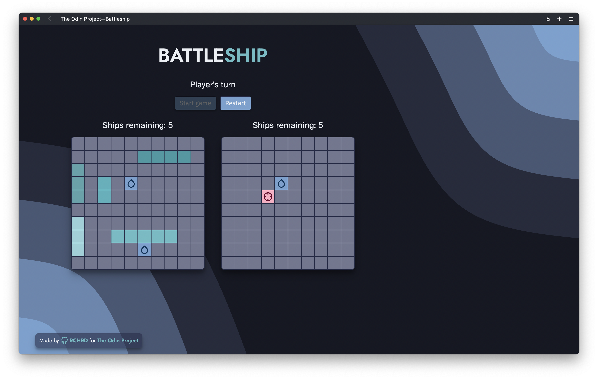

# battle-ship

A HTML, CSS and Javascript project from The Odin Project's [curriculum](https://www.theodinproject.com/lessons/node-path-javascript-battleship). Main focus:
* Unit testing with Jest, Webpack, working with ES6 modules

Sources:
* Icons from [Feather](https://feathericons.com/)
* Background image from [Haikei](https://haikei.app/)